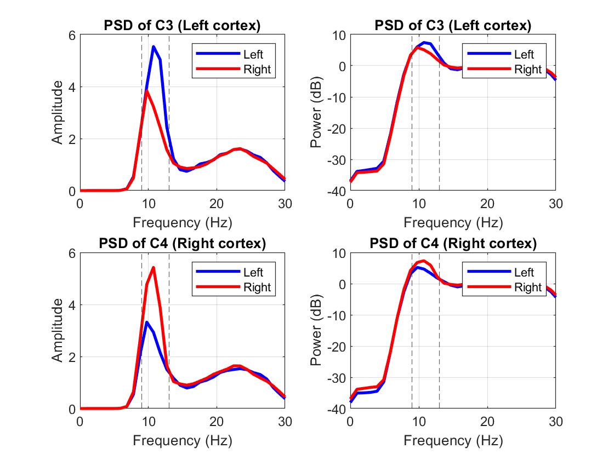

# EEG-Motor-Imagery-Classification-using-Mu-Rhythm-Features

This project implements a basic EEG motor imagery classification pipeline using the BCI Competition IV-2a dataset.
The goal is to classify left-hand vs right-hand motor imagery using physiologically motivated features derived from the mu rhythm (8–13 Hz).

## Dataset: BCI Competition IV Dataset 2a 
#### Download the dataset from:
https://www.kaggle.com/datasets/thngdngvn/bci-competition-iv-data-sets-2a

Files used in this project:
- A01T.mat
- A02T.mat
- A03T.mat 

Place them in the same directory as the MATLAB scripts.

#### Within each .mat file
- 22 EEG channels (+3 EOG channels)
- 4 classes (left hand, right hand, feet, tongue)
- Only left vs right imagery used in this project

## Data Preparation (ref. Data_org.m)
1. Load subject data (ex. A01T.mat)
2. Extract trials using provided indices
3. Remove artifact-contaminated trials
4. Segment motor imagery window (2–6 seconds)
5. Bandpass filter in mu band (9–13 Hz)
6. Construct 3D dataset (trials × samples × channels)

As the dataset is reenvisioned as a tensor of trials, the 'trials' input data is limited to one single subject only. This is done to avoid inter-subject variability, which significantly affects model performance.
In later iterations, the 'trials' dataset can be enlarged to include the trials from the other 8 subjects as well.

## Physiological Motivation (ref. PSD_Analysis.m)
Power Spectral Density (PSD) analysis reveals suppression of the mu rhythm (9–13 Hz)
during motor imagery in the opposite cortex.

At electrode C3 (left motor cortex):
- Right-hand imagery shows reduced mu power

At electrode C4 (right motor cortex):
- Left-hand imagery shows reduced mu power

This phenomenon, known as Event-Related Desynchronization (ERD), occurs when activity suppresses the resting mu rhythm.
This asymmetrical suppression between the hemispheres motivates the use of variance and bandpower-based features for discriminating left vs right motor imagery.

## Feature Extraction (ref. feats.m)
Three features are extracted per trial:
1. log(var(C3)) → left motor cortex activity
2. log(var(C4)) → right motor cortex activity
3. log(pL / pR) → hemispheric power ratio
These features are motivated by Event-Related Desynchronization (ERD), where motor imagery suppresses the mu rhythm.
Interpretation: for left-hand imagery, the left cortex shows higher power than the right cortex due to desynchronization and vice versa. 

## Classification and Results
Classifier: Linear Discriminant Analysis (LDA)
- Data split: 70% training / 30% testing
- Evaluation: classification accuracy

Single-subject classification performance (mean ± std averaged over 100 random test-train split runs):

- A01T: 58% ± 6%
- A02T: 51% ± 6%
- A03T: 86% ± 4%

Significant variation is observed across subjects.
While A03T exhibits strong separability, A02T remains near chance level, showcasing the differing motor imagery patterns between individuals. Due to this inter-subject variability, multi-subject classification further reduces performance to near chance (~50%), as the used simple features do not generalize across subjects.

### Key Insights
- Implement Common Spatial Patterns (CSP)
- Use filter bank approaches (FBCSP)
- Explore cross-subject generalization
- Try SVM or deep learning models

### Limitations
- Features are simple (no spatial filtering like CSP)
- Performance varies across subjects
- No cross-validation used (optional improvement)

### Future Scope
- Implement Common Spatial Patterns (CSP)
- Use filter bank approaches (FBCSP)
- Explore cross-subject generalization
- Try SVM or deep learning models
